# 미들웨어 시스템 심층 분석

> Deep Agents의 미들웨어 스택이 어떻게 에이전트의 동작을 확장하고 수정하는지 상세히 분석합니다.

## 미들웨어란?

미들웨어(Middleware)는 에이전트의 요청-응답 사이클에 개입하여 동작을 확장하거나 수정하는 컴포넌트입니다. 각 미들웨어는 특정 책임을 가지며, 스택 형태로 순서대로 적용됩니다.

```mermaid
graph TD
    Input["사용자 입력"] --> mw1
    subgraph MiddlewareStack["Middleware Stack Flow"]
        mw1["1. TodoListMiddleware<br/>before_agent: 할 일 도구 추가"]
        mw2["2. MemoryMiddleware<br/>before_agent: AGENTS.md 로딩<br/>wrap_model_call: 시스템 프롬프트에 메모리 주입"]
        mw3["3. SkillsMiddleware<br/>before_agent: SKILL.md 메타데이터 로딩<br/>wrap_model_call: 시스템 프롬프트에 스킬 목록 주입"]
        mw4["4. FilesystemMiddleware<br/>tools: ls, read_file, write_file, edit_file, ...<br/>wrap_tool_call: 대용량 결과 파일 저장"]
        mw5["5. SubAgentMiddleware<br/>tools: task &#40;서브에이전트 호출&#41;<br/>wrap_model_call: 서브에이전트 설명 주입"]
        mw6["6. SummarizationMiddleware<br/>긴 컨텍스트 자동 요약"]
        mw7["7. AnthropicPromptCachingMiddleware<br/>Anthropic 모델 프롬프트 캐싱 최적화"]
        mw8["8. PatchToolCallsMiddleware<br/>도구 호출 결과 패치"]
        mw9["9. 사용자 정의 미들웨어"]
        mw10["10. HumanInTheLoopMiddleware &#40;선택&#41;<br/>특정 도구 실행 전 승인 요청"]

        mw1 --> mw2 --> mw3 --> mw4 --> mw5
        mw5 --> mw6 --> mw7 --> mw8 --> mw9 --> mw10
    end
    mw10 --> Output["LLM 응답"]
```



## 미들웨어 생명주기 메서드

각 미들웨어는 다음 메서드들을 구현할 수 있습니다:

### 1. `before_agent`
에이전트 실행 **시작 전**에 호출됩니다. 상태 초기화나 리소스 로딩에 사용됩니다.

```python
def before_agent(
    self,
    state: AgentState,
    runtime: Runtime,
    config: RunnableConfig
) -> StateUpdate | None:
    """에이전트 실행 전에 상태를 업데이트합니다."""
    # 예: 메모리나 스킬 로딩
    return {"memory_contents": loaded_contents}
```

### 2. `wrap_model_call`
LLM 호출을 **감싸서** 요청/응답을 수정합니다.

```python
def wrap_model_call(
    self,
    request: ModelRequest,
    handler: Callable[[ModelRequest], ModelResponse],
) -> ModelResponse:
    """LLM 호출 전후에 처리를 수행합니다."""
    # 요청 수정 (예: 시스템 프롬프트에 내용 추가)
    modified_request = request.override(system_message=new_system_message)

    # 실제 LLM 호출
    response = handler(modified_request)

    # 응답 수정 (필요시)
    return response
```

### 3. `wrap_tool_call`
도구 호출을 **감싸서** 입력/출력을 수정합니다.

```python
def wrap_tool_call(
    self,
    request: ToolCallRequest,
    handler: Callable[[ToolCallRequest], ToolMessage | Command],
) -> ToolMessage | Command:
    """도구 호출 전후에 처리를 수행합니다."""
    # 도구 실행
    result = handler(request)

    # 결과 처리 (예: 대용량 결과 파일로 저장)
    return processed_result
```

### 4. `tools` 속성
미들웨어가 제공하는 도구 목록입니다.

```python
class FilesystemMiddleware(AgentMiddleware):
    def __init__(self, ...):
        self.tools = [
            self._create_ls_tool(),
            self._create_read_file_tool(),
            self._create_write_file_tool(),
            # ...
        ]
```

---

## 핵심 미들웨어 상세

### 1. TodoListMiddleware

**역할**: 에이전트의 계획 수립과 작업 추적을 지원합니다.

**제공 도구**: `write_todos`

**사용 예시**:
```python
# 에이전트가 할 일 목록을 관리
write_todos(todos=[
    {"task": "프로젝트 구조 분석", "status": "completed"},
    {"task": "코드 리뷰", "status": "in_progress"},
    {"task": "테스트 작성", "status": "pending"},
])
```

---

### 2. MemoryMiddleware

**역할**: AGENTS.md 파일에서 영속 컨텍스트를 로딩하여 시스템 프롬프트에 주입합니다.

**소스 위치**: `libs/deepagents/deepagents/middleware/memory.py`

**동작 흐름**:

```python
# 1. before_agent: 메모리 파일 로딩
def before_agent(self, state, runtime, config) -> MemoryStateUpdate | None:
    if "memory_contents" in state:
        return None  # 이미 로드됨

    backend = self._get_backend(state, runtime, config)
    contents: dict[str, str] = {}

    for path in self.sources:
        content = self._load_memory_from_backend_sync(backend, path)
        if content:
            contents[path] = content

    return MemoryStateUpdate(memory_contents=contents)

# 2. wrap_model_call: 시스템 프롬프트에 주입
def wrap_model_call(self, request, handler):
    contents = request.state.get("memory_contents", {})
    agent_memory = self._format_agent_memory(contents)

    new_system_message = append_to_system_message(
        request.system_message,
        agent_memory
    )
    return handler(request.override(system_message=new_system_message))
```

**시스템 프롬프트 템플릿** (memory.py:93-152):
```xml
<agent_memory>
{로드된 AGENTS.md 내용}
</agent_memory>

<memory_guidelines>
    **학습 지침:**
    - 사용자 피드백에서 학습하세요
    - 교정이 있을 때 즉시 메모리를 업데이트하세요
    - 근본 원칙을 찾아 기록하세요

    **메모리 업데이트 시점:**
    - 사용자가 기억해달라고 요청할 때
    - 역할이나 행동 방식을 설명받을 때
    - 작업에 대한 피드백을 받을 때

    **메모리 업데이트하지 않을 때:**
    - 일시적인 정보 (날씨, 현재 상태 등)
    - 일회성 작업 요청
    - API 키, 비밀번호 등 민감한 정보
</memory_guidelines>
```

**설계 이유**:
- **영속 학습**: 에이전트가 세션 간에 학습한 내용을 기억
- **자동 업데이트 유도**: 에이전트에게 언제 메모리를 업데이트해야 하는지 명시적으로 안내

---

### 3. SkillsMiddleware

**역할**: SKILL.md 파일에서 스킬 정의를 로딩하고 점진적 공개(Progressive Disclosure) 패턴을 적용합니다.

**소스 위치**: `libs/deepagents/deepagents/middleware/skills.py`

**스킬 디렉토리 구조**:
```
/skills/
├── web-research/
│   └── SKILL.md
├── code-review/
│   └── SKILL.md
│   └── review_checklist.md
└── data-analysis/
    └── SKILL.md
    └── scripts/
        └── analyze.py
```

**SKILL.md 포맷**:
```markdown
---
name: web-research
description: 구조화된 웹 리서치 수행을 위한 스킬
license: MIT
---

# Web Research Skill

## When to Use
- 사용자가 특정 주제에 대한 리서치를 요청할 때
- 최신 정보나 트렌드 파악이 필요할 때

## Workflow
1. 검색 쿼리 구성
2. 여러 소스에서 정보 수집
3. 정보 검증 및 정리
4. 구조화된 보고서 작성
```

**점진적 공개 패턴**:
```python
# 시스템 프롬프트에는 메타데이터만 노출
SKILLS_SYSTEM_PROMPT = """
## Skills System

**Available Skills:**
- **web-research**: 구조화된 웹 리서치 수행을 위한 스킬
  -> Read `/skills/web-research/SKILL.md` for full instructions
- **code-review**: 코드 품질 검토 스킬
  -> Read `/skills/code-review/SKILL.md` for full instructions

**How to Use Skills:**
1. 작업이 스킬에 해당하는지 확인
2. read_file로 전체 지침 로드
3. 스킬 지침에 따라 작업 수행
"""
```

**설계 이유**:
- **컨텍스트 효율성**: 모든 스킬 내용을 미리 로드하지 않고 필요할 때만 로드
- **확장성**: 새 스킬 추가 시 파일만 추가하면 자동 인식
- **우선순위 지원**: 나중 소스가 이전 소스를 오버라이드

---

### 4. FilesystemMiddleware

**역할**: 파일 시스템 작업 도구를 제공하고 대용량 결과를 자동으로 파일로 저장합니다.

**소스 위치**: `libs/deepagents/deepagents/middleware/filesystem.py`

**제공 도구**:

| 도구 | 설명 | 주요 파라미터 |
|------|------|--------------|
| `ls` | 디렉토리 목록 | `path` |
| `read_file` | 파일 읽기 (페이지네이션) | `file_path`, `offset`, `limit` |
| `write_file` | 새 파일 생성 | `file_path`, `content` |
| `edit_file` | 파일 편집 (문자열 치환) | `file_path`, `old_string`, `new_string` |
| `glob` | 글로브 패턴 매칭 | `pattern`, `path` |
| `grep` | 텍스트 검색 | `pattern`, `path`, `glob`, `output_mode` |
| `execute` | 셸 명령 실행 (Sandbox) | `command` |

**대용량 결과 자동 처리** (filesystem.py:995-1066):
```python
def _process_large_message(self, message: ToolMessage, backend) -> tuple[ToolMessage, dict | None]:
    """대용량 도구 결과를 파일로 저장합니다."""

    # 토큰 한도 초과 확인
    if len(content_str) <= NUM_CHARS_PER_TOKEN * self._tool_token_limit_before_evict:
        return message, None

    # 파일로 저장
    file_path = f"/large_tool_results/{sanitized_id}"
    result = backend.write(file_path, content_str)

    # 미리보기 생성 (처음 5줄 + 마지막 5줄)
    content_sample = _create_content_preview(content_str)

    # 대체 메시지 생성
    replacement_text = f"""Tool result too large, saved at: {file_path}

You can read the result using read_file tool with pagination.

Preview:
{content_sample}
"""
    return ToolMessage(content=replacement_text, ...), result.files_update
```

**설계 이유**:
- **컨텍스트 보호**: 대용량 결과가 컨텍스트 윈도우를 가득 채우는 것 방지
- **점진적 접근**: 에이전트가 필요한 부분만 페이지네이션으로 읽을 수 있음

---

### 5. SubAgentMiddleware

**역할**: 서브에이전트를 관리하고 `task` 도구를 제공합니다.

**소스 위치**: `libs/deepagents/deepagents/middleware/subagents.py`

**제공 도구**: `task`

**task 도구 시그니처**:
```python
def task(
    description: str,      # 서브에이전트에게 전달할 작업 설명
    subagent_type: str,    # 사용할 서브에이전트 유형
    runtime: ToolRuntime,
) -> str | Command:
    """서브에이전트를 호출하여 작업을 위임합니다."""
```

**서브에이전트 생명주기** (subagents.py:402-446):
```python
def task(description, subagent_type, runtime) -> str | Command:
    # 1. 서브에이전트 유효성 검사
    if subagent_type not in subagent_graphs:
        return f"Invalid subagent type: {subagent_type}"

    # 2. 상태 준비 (메시지, 일부 키 제외)
    subagent_state = {
        k: v for k, v in runtime.state.items()
        if k not in _EXCLUDED_STATE_KEYS
    }
    subagent_state["messages"] = [HumanMessage(content=description)]

    # 3. 서브에이전트 실행
    result = subagent.invoke(subagent_state)

    # 4. 결과 반환 (최종 메시지만)
    return Command(update={
        **state_update,
        "messages": [ToolMessage(result["messages"][-1].text, ...)],
    })
```

**시스템 프롬프트 주입** (subagents.py:239-265):
```
## task (subagent spawner)

서브에이전트를 사용하는 시점:
- 복잡하고 다단계인 독립적 작업
- 병렬로 실행 가능한 작업
- 토큰/컨텍스트 사용량이 많은 작업
- 결과만 필요하고 중간 과정은 필요 없는 작업

사용하지 않을 시점:
- 몇 번의 도구 호출로 끝나는 단순 작업
- 위임해도 토큰 절약이 안 되는 경우
```

**설계 이유**:
- **컨텍스트 격리**: 각 서브에이전트는 독립적인 컨텍스트에서 실행
- **병렬 실행**: 여러 `task` 호출을 동시에 수행 가능
- **결과 압축**: 서브에이전트의 전체 히스토리 대신 최종 결과만 반환

---

### 6. SummarizationMiddleware

**역할**: 대화가 길어질 때 자동으로 이전 내용을 요약하여 컨텍스트 윈도우를 관리합니다.

**동작 방식**:
- 토큰 수가 임계값을 초과하면 이전 메시지들을 요약
- 요약본으로 대체하여 컨텍스트 공간 확보
- 최근 메시지는 유지하여 연속성 보장

**설정 옵션** (graph.py:196, 286-293):
```python
summarization_defaults = _compute_summarization_defaults(model)

SummarizationMiddleware(
    model=model,
    backend=backend,
    trigger=summarization_defaults["trigger"],      # 요약 트리거 토큰 수
    keep=summarization_defaults["keep"],            # 유지할 최근 메시지 수
    truncate_args_settings=summarization_defaults["truncate_args_settings"],
)
```

---

### 7. AnthropicPromptCachingMiddleware

**역할**: Anthropic Claude 모델 사용 시 프롬프트 캐싱을 최적화합니다.

**동작 방식**:
- 시스템 프롬프트와 도구 정의를 캐시 가능하게 표시
- 반복 호출 시 비용과 지연 시간 절감

**비-Anthropic 모델 처리**:
```python
AnthropicPromptCachingMiddleware(unsupported_model_behavior="ignore")
# Anthropic 모델이 아니면 조용히 무시
```

---

### 8. PatchToolCallsMiddleware

**역할**: 도구 호출 결과를 패치하여 일관성을 보장합니다.

---

### 9. HumanInTheLoopMiddleware

**역할**: 특정 도구 호출 전에 에이전트 실행을 일시 중지하고 사람의 승인을 요청합니다.

**설정 예시**:
```python
interrupt_on={
    "edit_file": True,              # 모든 파일 편집 전 중단
    "execute": {                     # 조건부 중단
        "requires_approval": lambda args: "rm" in args.get("command", ""),
    },
}
```

**사용 시 필수 조건**:
- `checkpointer` 파라미터 필수 (상태 저장 필요)

---

## 커스텀 미들웨어 작성

### 기본 템플릿

```python
from langchain.agents.middleware.types import (
    AgentMiddleware,
    AgentState,
    ModelRequest,
    ModelResponse,
)

class CustomMiddleware(AgentMiddleware):
    """커스텀 미들웨어 예제"""

    # 선택: 상태 스키마 확장
    state_schema = CustomState

    def __init__(self, **kwargs):
        super().__init__()
        # 초기화 로직

    def before_agent(self, state, runtime, config):
        """에이전트 실행 전 호출"""
        # 상태 초기화나 리소스 로딩
        return {"custom_key": "value"}

    def wrap_model_call(self, request, handler):
        """LLM 호출 감싸기"""
        # 요청 수정
        modified_request = self.modify_request(request)

        # 실제 호출
        response = handler(modified_request)

        # 응답 처리
        return response

    def wrap_tool_call(self, request, handler):
        """도구 호출 감싸기"""
        result = handler(request)
        # 결과 처리
        return result
```

### 실제 예제: 로깅 미들웨어

```python
import logging
from datetime import datetime

class LoggingMiddleware(AgentMiddleware):
    """모든 LLM 호출과 도구 호출을 로깅하는 미들웨어"""

    def __init__(self, logger: logging.Logger | None = None):
        super().__init__()
        self.logger = logger or logging.getLogger(__name__)

    def wrap_model_call(self, request, handler):
        start = datetime.now()
        self.logger.info(f"LLM 호출 시작 - 메시지 수: {len(request.messages)}")

        response = handler(request)

        elapsed = (datetime.now() - start).total_seconds()
        self.logger.info(f"LLM 호출 완료 - 소요 시간: {elapsed:.2f}s")

        return response

    def wrap_tool_call(self, request, handler):
        tool_name = request.tool_call.get("name", "unknown")
        self.logger.info(f"도구 호출: {tool_name}")

        result = handler(request)

        self.logger.info(f"도구 완료: {tool_name}")
        return result
```

### 사용

```python
agent = create_deep_agent(
    middleware=[LoggingMiddleware()],
)
```

---

## 미들웨어 순서의 중요성

미들웨어 순서는 동작에 큰 영향을 미칩니다:

1. **MemoryMiddleware와 SkillsMiddleware가 먼저**:
   - 시스템 프롬프트에 컨텍스트를 추가한 후 다른 미들웨어가 실행

2. **FilesystemMiddleware가 SubAgentMiddleware보다 먼저**:
   - 서브에이전트도 파일 시스템 도구를 사용

3. **SummarizationMiddleware가 후반부에**:
   - 다른 미들웨어가 추가한 내용을 포함하여 요약

4. **HumanInTheLoopMiddleware가 마지막**:
   - 최종 도구 호출 전에 승인 요청

---

## 다음 단계

- [백엔드 시스템](./backend-system.md): 파일 저장소와 실행 환경 추상화
- [커스텀 미들웨어 작성](../06-advanced/custom-middleware.md): 고급 미들웨어 패턴
