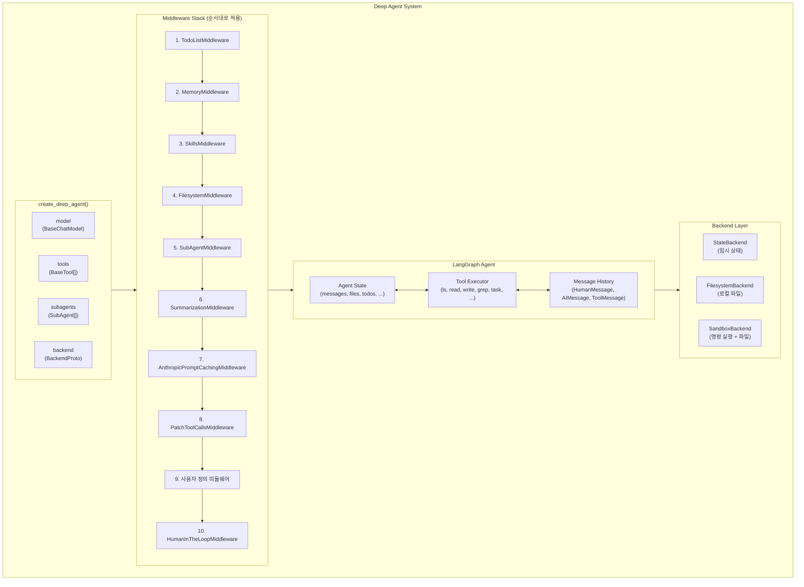
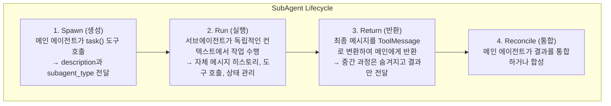
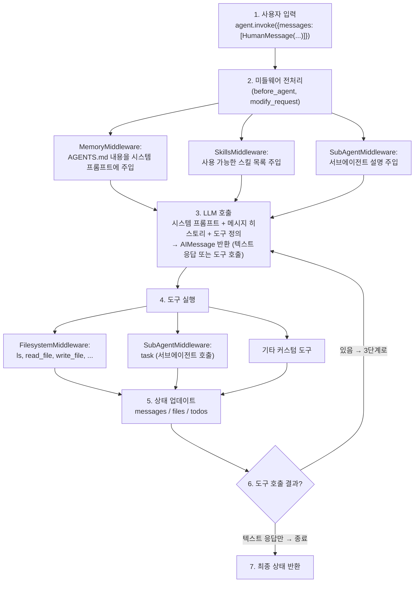

# 시스템 아키텍처 개요

> Deep Agents의 전체 시스템 아키텍처와 데이터 흐름을 이해합니다.

## 아키텍처 다이어그램



## 핵심 컴포넌트

### 1. create_deep_agent() 팩토리 함수

`create_deep_agent()`는 Deep Agent의 진입점입니다. 이 함수는 모델, 도구, 서브에이전트, 백엔드를 조합하여 완전한 기능을 갖춘 에이전트를 생성합니다.

**소스 위치**: `libs/deepagents/deepagents/graph.py:96-114`

```python
def create_deep_agent(
    model: str | BaseChatModel | None = None,     # LLM 모델
    tools: Sequence[BaseTool | Callable | dict[str, Any]] | None = None,  # 커스텀 도구
    *,
    system_prompt: str | SystemMessage | None = None,  # 시스템 프롬프트
    middleware: Sequence[AgentMiddleware] = (),    # 추가 미들웨어
    subagents: list[SubAgent | CompiledSubAgent] | None = None,  # 서브에이전트
    skills: list[str] | None = None,               # 스킬 경로
    memory: list[str] | None = None,               # 메모리 경로
    backend: BackendProtocol | BackendFactory | None = None,  # 백엔드
    interrupt_on: dict[str, bool | InterruptOnConfig] | None = None,  # 중단 설정
    ...
) -> CompiledStateGraph:
```

**설계 이유**:
- **팩토리 패턴**: 복잡한 객체 생성 로직을 캡슐화하여 사용자가 간단한 인터페이스로 에이전트를 생성할 수 있게 합니다.
- **기본값 제공**: 대부분의 파라미터에 합리적인 기본값을 제공하여 최소한의 코드로 시작할 수 있습니다.
- **확장성**: 모든 컴포넌트를 선택적으로 커스터마이징할 수 있어 점진적으로 복잡한 에이전트를 구축할 수 있습니다.

### 2. 미들웨어 스택 (Middleware Stack)

미들웨어는 에이전트의 동작을 확장하고 수정하는 레이어입니다. 각 미들웨어는 특정 책임을 가지며, 순서대로 적용됩니다.

**소스 위치**: `libs/deepagents/deepagents/graph.py:271-301`

```python
# 기본 미들웨어 스택 빌드 로직
deepagent_middleware: list[AgentMiddleware] = [
    TodoListMiddleware(),                          # 1. 할 일 관리
]
if memory is not None:
    deepagent_middleware.append(MemoryMiddleware(backend=backend, sources=memory))  # 2. 메모리
if skills is not None:
    deepagent_middleware.append(SkillsMiddleware(backend=backend, sources=skills))  # 3. 스킬
deepagent_middleware.extend([
    FilesystemMiddleware(backend=backend),         # 4. 파일 시스템
    SubAgentMiddleware(backend=backend, subagents=all_subagents),  # 5. 서브에이전트
    SummarizationMiddleware(model=model, backend=backend, ...),    # 6. 요약
    AnthropicPromptCachingMiddleware(unsupported_model_behavior="ignore"),  # 7. 캐싱
    PatchToolCallsMiddleware(),                    # 8. 도구 호출 패치
])
if middleware:
    deepagent_middleware.extend(middleware)        # 9. 사용자 정의
if interrupt_on is not None:
    deepagent_middleware.append(HumanInTheLoopMiddleware(interrupt_on=interrupt_on))  # 10. HITL
```

**미들웨어 역할 상세**:

| 순서 | 미들웨어 | 역할 | 제공 도구 |
|------|----------|------|----------|
| 1 | `TodoListMiddleware` | 에이전트의 계획 수립과 작업 추적 | `write_todos` |
| 2 | `MemoryMiddleware` | AGENTS.md 파일에서 영속 컨텍스트 로딩 | - |
| 3 | `SkillsMiddleware` | SKILL.md 파일에서 스킬 정의 로딩 | - |
| 4 | `FilesystemMiddleware` | 파일 시스템 작업 도구 제공 | `ls`, `read_file`, `write_file`, `edit_file`, `glob`, `grep`, `execute` |
| 5 | `SubAgentMiddleware` | 서브에이전트 호출 관리 | `task` |
| 6 | `SummarizationMiddleware` | 긴 대화 컨텍스트 요약 | - |
| 7 | `AnthropicPromptCachingMiddleware` | Anthropic 모델 프롬프트 캐싱 | - |
| 8 | `PatchToolCallsMiddleware` | 도구 호출 결과 패치 | - |
| 9 | 사용자 정의 | 커스텀 동작 추가 | 사용자 정의 |
| 10 | `HumanInTheLoopMiddleware` | 특정 도구에 대한 승인 워크플로우 | - |

**설계 이유**:
- **단일 책임 원칙**: 각 미들웨어는 하나의 명확한 책임만 가집니다.
- **순서 의존성**: 메모리와 스킬은 파일 시스템보다 먼저 로드되어야 하며, HITL은 마지막에 적용되어야 합니다.
- **조건부 추가**: `memory`, `skills`, `interrupt_on` 등은 필요한 경우에만 추가됩니다.

### 3. 백엔드 시스템 (Backend System)

백엔드는 파일 저장소와 명령 실행 환경을 추상화합니다.

**소스 위치**: `libs/deepagents/deepagents/backends/protocol.py`

```python
class BackendProtocol(abc.ABC):
    """플러그형 백엔드를 위한 프로토콜"""

    def ls_info(self, path: str) -> list["FileInfo"]: ...      # 디렉토리 목록
    def read(self, file_path: str, offset: int, limit: int) -> str: ...  # 파일 읽기
    def write(self, file_path: str, content: str) -> WriteResult: ...   # 파일 쓰기
    def edit(self, file_path: str, old_string: str, new_string: str) -> EditResult: ...  # 파일 편집
    def grep_raw(self, pattern: str, path: str | None) -> list["GrepMatch"] | str: ...  # 검색
    def glob_info(self, pattern: str, path: str) -> list["FileInfo"]: ...  # 글로브 매칭

class SandboxBackendProtocol(BackendProtocol):
    """샌드박스 실행을 지원하는 백엔드"""

    def execute(self, command: str) -> ExecuteResponse: ...    # 명령 실행
```

**백엔드 유형**:

| 백엔드 | 설명 | 사용 사례 |
|--------|------|----------|
| `StateBackend` | 에이전트 상태 내 임시 저장소 | 기본값, 테스트, 임시 작업 |
| `FilesystemBackend` | 로컬 파일 시스템 | 영속 저장소, 프로젝트 작업 |
| `CompositeBackend` | 경로 기반 라우팅 | 하이브리드 (예: `/memories/`는 영속, 나머지는 임시) |
| 커스텀 샌드박스 | Docker, 원격 서버 등 | 안전한 명령 실행 |

**설계 이유**:
- **추상화**: 동일한 인터페이스로 다양한 저장소를 사용할 수 있습니다.
- **팩토리 패턴 지원**: `lambda rt: StateBackend(rt)` 형태로 런타임에 백엔드를 생성할 수 있습니다.
- **보안 분리**: `SandboxBackendProtocol`은 명령 실행이 필요한 경우에만 구현합니다.

### 4. 서브에이전트 시스템 (SubAgent System)

서브에이전트는 복잡한 작업을 독립적인 컨텍스트에서 처리하는 자식 에이전트입니다.

**소스 위치**: `libs/deepagents/deepagents/middleware/subagents.py:22-78`

```python
class SubAgent(TypedDict):
    """서브에이전트 사양"""

    name: str           # 고유 식별자 (메인 에이전트가 task() 도구 호출 시 사용)
    description: str    # 설명 (메인 에이전트가 위임 결정에 사용)
    system_prompt: str  # 서브에이전트의 시스템 프롬프트

    # 선택적 필드
    tools: NotRequired[Sequence[BaseTool | Callable | dict[str, Any]]]  # 도구 (미지정시 상속)
    model: NotRequired[str | BaseChatModel]  # 모델 (미지정시 상속)
    middleware: NotRequired[list[AgentMiddleware]]  # 추가 미들웨어
    interrupt_on: NotRequired[dict[str, bool | InterruptOnConfig]]  # HITL 설정
    skills: NotRequired[list[str]]  # 스킬 경로
```

**서브에이전트 생명주기**:



**설계 이유**:
- **컨텍스트 격리**: 각 서브에이전트는 독립적인 컨텍스트를 가져 토큰 사용량을 최적화합니다.
- **병렬 실행**: 여러 서브에이전트를 동시에 실행하여 처리 시간을 단축합니다.
- **전문화**: 각 서브에이전트에 특화된 도구와 프롬프트를 제공합니다.

## 데이터 흐름

### 에이전트 실행 흐름



### 상태 스키마 (State Schema)

Deep Agent의 상태는 LangGraph의 `TypedDict`를 확장합니다:

```python
class DeepAgentState(TypedDict):
    messages: Annotated[list[BaseMessage], add_messages]  # 메시지 히스토리 (누적)
    files: Annotated[dict[str, FileData], _file_data_reducer]  # 파일 시스템 상태
    todos: NotRequired[list[Todo]]  # 할 일 목록
    memory_contents: NotRequired[dict[str, str]]  # 로드된 메모리 (Private)
    skills_metadata: NotRequired[list[SkillMetadata]]  # 로드된 스킬 (Private)
```

**상태 키 설명**:

| 키 | 타입 | Reducer | 설명 |
|----|------|---------|------|
| `messages` | `list[BaseMessage]` | `add_messages` | 메시지 히스토리, 새 메시지 추가 |
| `files` | `dict[str, FileData]` | `_file_data_reducer` | 파일 내용, None으로 삭제 가능 |
| `todos` | `list[Todo]` | - | 할 일 목록 |
| `memory_contents` | `dict[str, str]` | Private | 로드된 AGENTS.md 내용 |
| `skills_metadata` | `list[SkillMetadata]` | Private | 로드된 SKILL.md 메타데이터 |

## 설계 원칙

### 1. 점진적 복잡성 (Progressive Complexity)

Deep Agents는 단순한 시작부터 복잡한 엔터프라이즈 사용까지 점진적으로 확장할 수 있도록 설계되었습니다:

```python
# Level 1: 최소 설정
agent = create_deep_agent()

# Level 2: 커스텀 도구 추가
agent = create_deep_agent(tools=[my_tool])

# Level 3: 서브에이전트 추가
agent = create_deep_agent(tools=[my_tool], subagents=[researcher])

# Level 4: 메모리와 스킬 추가
agent = create_deep_agent(
    tools=[my_tool],
    subagents=[researcher],
    memory=["./AGENTS.md"],
    skills=["./skills/"],
)

# Level 5: 커스텀 백엔드와 미들웨어
agent = create_deep_agent(
    tools=[my_tool],
    subagents=[researcher],
    memory=["./AGENTS.md"],
    skills=["./skills/"],
    backend=DockerSandboxBackend(...),
    middleware=[CustomLoggingMiddleware()],
    interrupt_on={"edit_file": True},
)
```

### 2. 구성 가능성 (Composability)

모든 컴포넌트가 독립적으로 구성되고 조합될 수 있습니다:

- **미들웨어**: 순서대로 쌓이며 각각 독립적으로 동작
- **백엔드**: 인터페이스만 만족하면 어떤 구현체든 사용 가능
- **서브에이전트**: 각각 독립적인 설정과 도구를 가짐
- **도구**: LangChain BaseTool, 함수, dict 등 다양한 형태 지원

### 3. 컨텍스트 효율성 (Context Efficiency)

토큰 사용량을 최적화하기 위한 여러 메커니즘:

- **SummarizationMiddleware**: 긴 대화를 자동으로 요약
- **서브에이전트**: 컨텍스트를 격리하여 토큰 사용량 분산
- **스킬의 점진적 공개**: 스킬 메타데이터만 먼저 노출하고 필요시 전체 내용 로드
- **대용량 결과 파일 저장**: 큰 도구 결과를 파일로 저장하고 참조만 유지

---

## 다음 단계

- [미들웨어 시스템 심층 분석](./middleware-system.md)
- [백엔드 시스템 상세](./backend-system.md)
- [상태 관리 가이드](./state-management.md)
