# 스킬 시스템 (Skills System)

> 점진적 공개(Progressive Disclosure) 패턴으로 에이전트 워크플로우를 확장하는 스킬 시스템을 설명합니다.

## 개요

스킬 시스템은 에이전트에게 전문화된 워크플로우와 도메인 지식을 제공합니다. [Agent Skills 명세](https://agentskills.io/specification)를 구현합니다.

### 메모리 vs 스킬

| 구분 | 메모리 (Memory) | 스킬 (Skills) |
|------|----------------|---------------|
| 로드 시점 | 항상 (every turn) | 필요할 때 (on-demand) |
| 용도 | 지속적 컨텍스트 | 특정 워크플로우 |
| 크기 | 작음 (상시 로드) | 클 수 있음 (필요시 로드) |
| 파일 | AGENTS.md | SKILL.md |

```mermaid
graph TD
    subgraph Progressive["Progressive Disclosure Pattern"]
        P1["Phase 1: 메타데이터만 로드 &#40;항상&#41;<br/><br/>Available Skills:<br/>- web-research: 웹 리서치를 수행하는 구조화된 접근 방식<br/>  → Read /skills/web-research/SKILL.md<br/>- code-review: 코드 품질 및 보안 검토<br/>  → Read /skills/code-review/SKILL.md"]
        P2["Phase 2: 전체 지시사항 로드 &#40;필요할 때&#41;<br/><br/>Agent reads: /skills/web-research/SKILL.md<br/><br/># Web Research Skill<br/>## When to Use<br/>- 사용자가 주제를 조사해달라고 요청할 때<br/>## Workflow<br/>1. 검색 전략 수립<br/>2. 다양한 쿼리로 정보 수집<br/>3. 수집한 정보 검증 및 정리"]

        P1 -->|"사용자가 리서치 요청"| P2
    end
```



---

## SkillsMiddleware

**소스 위치**: `libs/deepagents/deepagents/middleware/skills.py:542-775`

### 클래스 정의

```python
class SkillsMiddleware(AgentMiddleware):
    """에이전트 스킬을 로드하고 시스템 프롬프트에 노출하는 미들웨어

    백엔드 소스에서 스킬을 로드하고 점진적 공개 방식으로
    시스템 프롬프트에 주입합니다.

    스킬은 소스 순서대로 로드되며, 나중에 로드된 소스가
    이전 것을 덮어씁니다 (마지막 승리).
    """

    state_schema = SkillsState

    def __init__(
        self,
        *,
        backend: BACKEND_TYPES,
        sources: list[str],
    ) -> None:
        self._backend = backend
        self.sources = sources
        self.system_prompt_template = SKILLS_SYSTEM_PROMPT
```

---

## SKILL.md 파일 형식

### 기본 구조

```markdown
---
name: web-research
description: 철저한 웹 리서치를 수행하는 구조화된 접근 방식
license: MIT
---

# Web Research Skill

## When to Use
- 사용자가 주제를 조사해달라고 요청할 때
- 최신 정보가 필요할 때
- 여러 소스에서 정보를 종합해야 할 때

## Workflow

### 1. 검색 전략 수립
- think 도구로 검색 전략 계획
- 다양한 각도의 쿼리 준비

### 2. 정보 수집
- web_search로 정보 검색
- 최소 3개 이상의 다른 쿼리 사용

### 3. 정보 검증
- 출처 신뢰성 평가
- 상충되는 정보 식별

### 4. 결과 정리
- 핵심 발견사항 요약
- 출처 목록 포함

## Output Format
- 핵심 요약 (3-5줄)
- 상세 내용 (섹션별 정리)
- 출처 목록
- 추가 조사 필요 사항
```

### YAML 프론트매터 필드

**소스 위치**: `skills.py:145-186`

```python
class SkillMetadata(TypedDict):
    """Agent Skills 명세에 따른 스킬 메타데이터"""

    name: str
    """스킬 식별자
    - 최대 64자
    - 소문자 영숫자와 하이픈만 허용 (a-z, 0-9, -)
    - 하이픈으로 시작/끝 불가, 연속 하이픈 불가
    """

    description: str
    """스킬의 기능 (최대 1024자)"""

    path: str
    """SKILL.md 파일의 경로"""

    license: str | None
    """라이선스 이름 또는 참조"""

    compatibility: str | None
    """환경 요구사항 (최대 500자)"""

    metadata: dict[str, str]
    """추가 메타데이터를 위한 키-값 매핑"""

    allowed_tools: list[str]
    """사전 승인된 도구 목록 (실험적)"""
```

**필드 설명**:

| 필드 | 필수 | 설명 |
|------|------|------|
| `name` | ✅ | 스킬 고유 식별자 |
| `description` | ✅ | 스킬 기능 설명 |
| `license` | ❌ | 라이선스 정보 |
| `compatibility` | ❌ | 호환성 요구사항 |
| `metadata` | ❌ | 추가 메타데이터 |
| `allowed-tools` | ❌ | 허용된 도구 목록 |

---

## 스킬 디렉토리 구조

### 기본 구조

```
/skills/
├── base/                          # 기본 스킬 (낮은 우선순위)
│   ├── web-research/
│   │   └── SKILL.md
│   └── code-review/
│       └── SKILL.md
├── user/                          # 사용자 스킬
│   └── my-workflow/
│       ├── SKILL.md
│       └── helper.py              # 지원 스크립트
└── project/                       # 프로젝트 스킬 (높은 우선순위)
    └── deployment/
        ├── SKILL.md
        └── deploy.sh
```

### 소스 우선순위

```python
# 소스 순서대로 로드, 나중 것이 우선
sources=[
    "/skills/base/",       # 기본 (덮어쓰일 수 있음)
    "/skills/user/",       # 사용자
    "/skills/project/",    # 프로젝트 (최종 우선)
]
```

**동일 이름 스킬 처리**:
- `/skills/base/web-research/` → 로드
- `/skills/project/web-research/` → 기존 것 덮어쓰기

---

## 스킬 로드 과정

### 1. before_agent 훅

**소스 위치**: `skills.py:667-702`

```python
def before_agent(
    self,
    state: SkillsState,
    runtime: Runtime,
    config: RunnableConfig,
) -> SkillsStateUpdate | None:
    """에이전트 실행 전 스킬 메타데이터 로드"""

    # 이미 로드되었으면 건너뛰기
    if "skills_metadata" in state:
        return None

    backend = self._get_backend(state, runtime, config)
    all_skills: dict[str, SkillMetadata] = {}

    # 소스 순서대로 로드 (나중 것이 덮어씀)
    for source_path in self.sources:
        source_skills = _list_skills(backend, source_path)
        for skill in source_skills:
            all_skills[skill["name"]] = skill

    skills = list(all_skills.values())
    return SkillsStateUpdate(skills_metadata=skills)
```

### 2. 스킬 발견

**소스 위치**: `skills.py:337-410`

```python
def _list_skills(backend: BackendProtocol, source_path: str) -> list[SkillMetadata]:
    """백엔드 소스에서 모든 스킬 나열"""

    skills: list[SkillMetadata] = []
    items = backend.ls_info(source_path)

    # 스킬 디렉토리 찾기
    skill_dirs = [item["path"] for item in items if item.get("is_dir")]

    if not skill_dirs:
        return []

    # 각 디렉토리에서 SKILL.md 다운로드
    skill_md_paths = []
    for skill_dir_path in skill_dirs:
        skill_dir = PurePosixPath(skill_dir_path)
        skill_md_path = str(skill_dir / "SKILL.md")
        skill_md_paths.append((skill_dir_path, skill_md_path))

    paths_to_download = [p for _, p in skill_md_paths]
    responses = backend.download_files(paths_to_download)

    # 다운로드된 SKILL.md 파싱
    for (skill_dir_path, skill_md_path), response in zip(
        skill_md_paths, responses, strict=True
    ):
        if response.error or response.content is None:
            continue

        content = response.content.decode("utf-8")
        directory_name = PurePosixPath(skill_dir_path).name

        skill_metadata = _parse_skill_metadata(
            content=content,
            skill_path=skill_md_path,
            directory_name=directory_name,
        )
        if skill_metadata:
            skills.append(skill_metadata)

    return skills
```

### 3. 시스템 프롬프트 주입

**소스 위치**: `skills.py:495-534`

```python
SKILLS_SYSTEM_PROMPT = """

## Skills System

You have access to a skills library that provides specialized capabilities
and domain knowledge.

{skills_locations}

**Available Skills:**

{skills_list}

**How to Use Skills (Progressive Disclosure):**

Skills follow a **progressive disclosure** pattern - you see their name
and description above, but only read full instructions when needed:

1. **Recognize when a skill applies**: Check if the user's task matches
   a skill's description
2. **Read the skill's full instructions**: Use the path shown in the
   skill list above
3. **Follow the skill's instructions**: SKILL.md contains step-by-step
   workflows, best practices, and examples
4. **Access supporting files**: Skills may include helper scripts, configs,
   or reference docs - use absolute paths

...
"""
```

---

## 스킬 검증

### 이름 검증

**소스 위치**: `skills.py:217-244`

```python
def _validate_skill_name(name: str, directory_name: str) -> tuple[bool, str]:
    """Agent Skills 명세에 따라 스킬 이름 검증

    요구사항:
    - 최대 64자
    - 소문자 영숫자와 하이픈만 (a-z, 0-9, -)
    - 하이픈으로 시작/끝 불가
    - 연속 하이픈 불가
    - 부모 디렉토리 이름과 일치
    """
    if not name:
        return False, "name is required"

    if len(name) > MAX_SKILL_NAME_LENGTH:
        return False, "name exceeds 64 characters"

    # 패턴: 소문자 영숫자, 세그먼트 사이 단일 하이픈
    if not re.match(r"^[a-z0-9]+(-[a-z0-9]+)*$", name):
        return False, "name must be lowercase alphanumeric with single hyphens only"

    if name != directory_name:
        return False, f"name '{name}' must match directory name '{directory_name}'"

    return True, ""
```

### 제약 조건

```python
# 보안: DoS 방지를 위한 최대 파일 크기 (10MB)
MAX_SKILL_FILE_SIZE = 10 * 1024 * 1024

# Agent Skills 명세 제약
MAX_SKILL_NAME_LENGTH = 64
MAX_SKILL_DESCRIPTION_LENGTH = 1024
```

---

## 사용 예제

### 기본 사용

```python
from deepagents import create_deep_agent
from deepagents.backends import FilesystemBackend

agent = create_deep_agent(
    skills=[
        "./skills/base/",
        "./skills/user/",
    ],
    backend=FilesystemBackend(root_dir="./"),
)
```

### 스킬 생성

**1. 디렉토리 생성**

```bash
mkdir -p ./skills/user/data-analysis/
```

**2. SKILL.md 작성**

```markdown
---
name: data-analysis
description: 데이터 분석 및 시각화를 위한 구조화된 워크플로우
---

# Data Analysis Skill

## When to Use
- 사용자가 데이터 분석을 요청할 때
- CSV, JSON 등 데이터 파일 처리 시
- 통계 분석이나 시각화가 필요할 때

## Workflow

### 1. 데이터 이해
- 데이터 형식 확인 (CSV, JSON, etc.)
- 컬럼/필드 파악
- 데이터 타입 확인

### 2. 데이터 정제
- 결측값 처리
- 이상치 확인
- 데이터 타입 변환

### 3. 분석 수행
- 기술 통계 (평균, 중앙값, 표준편차)
- 상관 분석
- 그룹별 분석

### 4. 시각화
- 적절한 차트 유형 선택
- 명확한 레이블과 제목
- 인사이트 강조

## Output Format
```python
# 분석 결과
{
    "summary": "핵심 발견사항",
    "statistics": {...},
    "visualizations": [...],
    "recommendations": [...]
}
```
```

**3. 에이전트에서 사용**

```python
# 에이전트가 자동으로 스킬 발견
agent = create_deep_agent(
    skills=["./skills/user/"],
)

# 사용자 요청 시 에이전트가 스킬 적용
result = agent.invoke({
    "messages": [{"role": "user", "content": "이 CSV 파일을 분석해줘"}]
})
```

---

## 지원 파일

스킬 디렉토리에 헬퍼 스크립트나 설정 파일을 포함할 수 있습니다.

```
/skills/user/deployment/
├── SKILL.md
├── deploy.sh           # 배포 스크립트
├── config.yaml         # 설정 파일
└── templates/
    └── docker-compose.yml
```

**SKILL.md에서 참조**:

```markdown
## Supporting Files

- `deploy.sh`: 배포 실행 스크립트
- `config.yaml`: 환경별 설정
- `templates/`: 템플릿 파일들

## Usage

```bash
# 배포 스크립트 실행
bash /skills/user/deployment/deploy.sh production
```
```

---

## 스킬 상태 스키마

### SkillsState

**소스 위치**: `skills.py:188-199`

```python
class SkillsState(AgentState):
    """스킬 미들웨어 상태

    AgentState를 확장하여 로드된 스킬 메타데이터를 포함합니다.
    skills_metadata는 PrivateStateAttr로 표시되어
    부모 에이전트에게 전파되지 않습니다.
    """

    skills_metadata: NotRequired[Annotated[list[SkillMetadata], PrivateStateAttr]]
```

---

## 모범 사례

### 1. 스킬 이름 규칙

```
✅ 좋은 예: web-research, code-review, data-analysis
❌ 나쁜 예: WebResearch, CODE_REVIEW, data--analysis
```

### 2. 설명 작성

```markdown
# 좋은 설명
description: 웹에서 정보를 검색하고 종합하는 구조화된 리서치 워크플로우

# 나쁜 설명 (너무 짧음)
description: 웹 검색
```

### 3. 워크플로우 구조

```markdown
## Workflow

### 1. 준비 단계
- 필요한 정보 파악
- 도구 확인

### 2. 실행 단계
- 구체적인 단계별 지침
- 예상 출력

### 3. 검증 단계
- 결과 확인
- 품질 체크
```

### 4. 출력 형식 명시

```markdown
## Output Format

결과는 다음 형식으로 제공합니다:

```json
{
  "status": "success",
  "data": {...},
  "metadata": {...}
}
```
```

---

## 문제 해결

### 스킬이 발견되지 않음

```python
# 경로 확인
import os
print(os.path.exists("./skills/user/web-research/SKILL.md"))

# 백엔드 설정 확인
backend = FilesystemBackend(root_dir="./")  # root_dir 확인
```

### YAML 파싱 오류

```markdown
# 올바른 YAML 프론트매터
---
name: my-skill
description: 스킬 설명
---

# 잘못된 예 (콜론 뒤 공백 필요)
---
name:my-skill  # ❌
description:스킬 설명  # ❌
---
```

### 스킬 이름 불일치

```
디렉토리: /skills/user/my-skill/
SKILL.md의 name: my-skill  # ✅ 일치해야 함
```

---

## 다음 단계

- [메모리 시스템](./memory-system.md)
- [서브에이전트 오케스트레이션](./subagent-orchestration.md)
- [커스텀 도구 패턴](../04-patterns/custom-tools.md)
