# 서브에이전트 오케스트레이션

> 복잡한 작업을 독립적인 서브에이전트에 위임하는 패턴을 상세히 설명합니다.

## 서브에이전트란?

서브에이전트(SubAgent)는 메인 에이전트가 복잡한 작업을 위임하는 자식 에이전트입니다. 각 서브에이전트는:

- **독립적인 컨텍스트**: 자체 메시지 히스토리와 상태를 가짐
- **전문화된 역할**: 특정 도메인에 특화된 도구와 프롬프트
- **결과만 반환**: 중간 과정은 숨기고 최종 결과만 메인에게 전달

```mermaid
graph TD
    subgraph Orchestration["SubAgent Orchestration"]
        MA["Main Agent<br/>&#40;Orchestrator&#41;"]
        RS["Researcher<br/>SubAgent"]
        CS["Coder<br/>SubAgent"]
        RV["Reviewer<br/>SubAgent"]
        RR["리서치 결과"]
        CR["코드 구현 결과"]
        VR["코드 검토 결과"]
        FI["최종 통합 결과"]

        MA --> RS
        MA --> CS
        MA --> RV
        RS --> RR
        CS --> CR
        RV --> VR
        RR --> FI
        CR --> FI
        VR --> FI
    end
```



## SubAgent TypedDict

**소스 위치**: `libs/deepagents/deepagents/middleware/subagents.py:22-78`

```python
class SubAgent(TypedDict):
    """서브에이전트 사양 정의"""

    # 필수 필드
    name: str
    """고유 식별자. 메인 에이전트가 task() 호출 시 사용"""

    description: str
    """서브에이전트 설명. 메인 에이전트가 위임 결정에 사용"""

    system_prompt: str
    """서브에이전트의 시스템 프롬프트. 역할과 지침 정의"""

    # 선택적 필드
    tools: NotRequired[Sequence[BaseTool | Callable | dict[str, Any]]]
    """서브에이전트가 사용할 도구. 미지정시 메인 에이전트 도구 상속"""

    model: NotRequired[str | BaseChatModel]
    """사용할 LLM 모델. 미지정시 메인 에이전트 모델 상속"""

    middleware: NotRequired[list[AgentMiddleware]]
    """추가 미들웨어. 기본 스택에 추가됨"""

    interrupt_on: NotRequired[dict[str, bool | InterruptOnConfig]]
    """Human-in-the-loop 설정"""

    skills: NotRequired[list[str]]
    """스킬 경로 목록"""
```

## 서브에이전트 생명주기

### 1. Spawn (생성)

메인 에이전트가 `task()` 도구를 호출할 때 서브에이전트가 생성됩니다.

```python
# 메인 에이전트의 도구 호출
task(
    description="Python으로 피보나치 함수를 구현하고 테스트를 작성해주세요.",
    subagent_type="coder",
)
```

### 2. Run (실행)

서브에이전트는 독립적인 컨텍스트에서 작업을 수행합니다.

```python
# task 도구 내부 로직 (subagents.py:422-446)
def task(description, subagent_type, runtime):
    # 상태 준비 (일부 키 제외)
    subagent_state = {
        k: v for k, v in runtime.state.items()
        if k not in _EXCLUDED_STATE_KEYS
    }
    # 새로운 메시지 히스토리 시작
    subagent_state["messages"] = [HumanMessage(content=description)]

    # 서브에이전트 실행
    result = subagent.invoke(subagent_state)
```

**제외되는 상태 키** (subagents.py:127):
```python
_EXCLUDED_STATE_KEYS = {
    "messages",           # 새 히스토리 시작
    "todos",              # 서브에이전트 자체 할 일 관리
    "structured_response",
    "skills_metadata",    # 자체 스킬 로드
    "memory_contents",    # 자체 메모리 로드
}
```

### 3. Return (반환)

서브에이전트 완료 시 최종 메시지만 메인에게 반환됩니다.

```python
# 결과 반환 (subagents.py:402-420)
def _return_command_with_state_update(result, tool_call_id):
    # 최종 메시지만 추출
    message_text = result["messages"][-1].text.rstrip()

    return Command(update={
        **state_update,
        "messages": [ToolMessage(message_text, tool_call_id=tool_call_id)],
    })
```

### 4. Reconcile (통합)

메인 에이전트가 서브에이전트 결과를 받아 통합합니다.

```python
# 메인 에이전트 관점
# task() 도구 결과로 ToolMessage 수신
# → 다른 서브에이전트 결과와 결합
# → 최종 응답 생성
```

## 서브에이전트 정의 예제

### 리서치 에이전트

**소스 참조**: `examples/deep_research/agent.py`

```python
from langchain_core.tools import tool

@tool
def web_search(query: str, max_results: int = 5) -> dict:
    """웹에서 정보를 검색합니다."""
    from tavily import TavilyClient
    client = TavilyClient()
    return client.search(query, max_results=max_results)

@tool
def think(thought: str) -> str:
    """생각을 정리하고 기록합니다."""
    return f"Thought recorded: {thought}"

research_agent = {
    "name": "researcher",
    "description": "웹 리서치를 수행하는 전문 에이전트. 한 번에 하나의 주제만 연구.",
    "system_prompt": """당신은 철저한 리서치를 수행하는 연구원입니다.

## 작업 방식
1. think 도구로 먼저 검색 전략 수립
2. web_search로 정보 수집 (다양한 쿼리 사용)
3. 수집한 정보를 정리하고 검증
4. 구조화된 리서치 결과 반환

## 출력 형식
- 핵심 발견사항 요약
- 상세 내용 (출처 포함)
- 추가 조사가 필요한 영역
""",
    "tools": [web_search, think],
}

agent = create_deep_agent(
    subagents=[research_agent],
    tools=[web_search, think],  # 메인도 동일 도구 사용 가능
)
```

### 코드 리뷰어 에이전트

```python
code_reviewer = {
    "name": "code-reviewer",
    "description": "코드 품질, 보안, 성능을 검토하는 에이전트",
    "system_prompt": """당신은 시니어 개발자로서 코드를 검토합니다.

## 검토 항목
1. **코드 품질**: 가독성, 유지보수성, DRY 원칙
2. **버그 가능성**: 엣지 케이스, 에러 처리
3. **보안**: 인젝션, 인증/인가, 민감 정보
4. **성능**: 알고리즘 복잡도, 메모리 사용

## 출력 형식
각 이슈에 대해:
- 위치 (파일:라인)
- 심각도 (Critical/High/Medium/Low)
- 문제 설명
- 개선 제안
""",
    "model": "openai:gpt-4o",  # 다른 모델 사용
}
```

### SQL 에이전트

**소스 참조**: `examples/text-to-sql-agent/agent.py`

```python
from langchain_community.agent_toolkits import SQLDatabaseToolkit
from langchain_community.utilities import SQLDatabase

# DB 연결
db = SQLDatabase.from_uri(f"sqlite:///{db_path}")
toolkit = SQLDatabaseToolkit(db=db, llm=model)
sql_tools = toolkit.get_tools()

sql_agent = {
    "name": "sql-analyst",
    "description": "데이터베이스 쿼리를 작성하고 실행하는 에이전트",
    "system_prompt": """당신은 SQL 전문가입니다.

## 작업 방식
1. 먼저 스키마를 확인 (sql_db_list_tables, sql_db_schema)
2. 쿼리 작성 전 테이블 구조 파악
3. 효율적인 쿼리 작성 (인덱스 활용)
4. 결과를 명확하게 설명

## 주의사항
- SELECT만 사용 (데이터 수정 금지)
- 대용량 결과는 LIMIT 사용
""",
    "tools": sql_tools,
}
```

## General-Purpose 서브에이전트

Deep Agents는 기본적으로 `general-purpose` 서브에이전트를 포함합니다.

**소스 위치**: `libs/deepagents/deepagents/middleware/subagents.py:268-275`

```python
GENERAL_PURPOSE_SUBAGENT: SubAgent = {
    "name": "general-purpose",
    "description": "General-purpose agent for researching complex questions, "
                   "searching for files and content, and executing multi-step tasks. "
                   "This agent has access to all tools as the main agent.",
    "system_prompt": DEFAULT_SUBAGENT_PROMPT,
}
```

**용도**:
- 메인 에이전트와 동일한 도구를 가진 범용 작업자
- 복잡한 작업을 격리된 컨텍스트에서 처리
- 토큰 사용량 최적화

## 병렬 서브에이전트 실행

여러 서브에이전트를 동시에 실행하여 처리 시간을 단축할 수 있습니다.

```python
# 메인 에이전트가 여러 task() 호출을 병렬로 실행
# LLM이 단일 응답에서 여러 도구 호출 생성

# 예: 세 명의 농구 선수 리서치
# → 각 선수에 대해 별도의 task() 호출
# → 세 서브에이전트가 동시에 실행
# → 결과를 모아서 비교 분석
```

**시스템 프롬프트 안내** (subagents.py:137-138):
```
1. Launch multiple agents concurrently whenever possible,
   to maximize performance; to do that, use a single message
   with multiple tool uses
```

## CompiledSubAgent

사전에 컴파일된 LangGraph 에이전트를 서브에이전트로 사용할 수 있습니다.

**소스 위치**: `libs/deepagents/deepagents/middleware/subagents.py:81-110`

```python
class CompiledSubAgent(TypedDict):
    """사전 컴파일된 에이전트 사양"""

    name: str
    description: str
    runnable: Runnable
    """커스텀 에이전트 구현. 상태에 'messages' 키 필수."""
```

**사용 예시**:
```python
from langchain.agents import create_agent

# 커스텀 LangGraph 에이전트 생성
custom_agent = create_agent(
    model,
    tools=[...],
    system_prompt="...",
)

compiled_subagent = {
    "name": "custom-agent",
    "description": "특수 목적 커스텀 에이전트",
    "runnable": custom_agent,
}

agent = create_deep_agent(
    subagents=[compiled_subagent],
)
```

## 서브에이전트 사용 지침

### 언제 사용하나?

| 상황 | 서브에이전트 사용 | 이유 |
|------|------------------|------|
| 복잡한 다단계 작업 | ✅ | 컨텍스트 격리로 집중 가능 |
| 독립적인 병렬 작업 | ✅ | 동시 실행으로 시간 단축 |
| 토큰 집약적 작업 | ✅ | 결과만 반환하여 컨텍스트 절약 |
| 단순한 몇 번의 도구 호출 | ❌ | 오버헤드가 더 큼 |
| 중간 과정 확인 필요 | ❌ | 서브에이전트 내부는 숨겨짐 |

### 서브에이전트 설계 팁

1. **명확한 역할 정의**: `description`이 구체적이어야 메인이 올바르게 위임
2. **적절한 도구 제공**: 필요한 도구만 제공하여 집중도 향상
3. **구조화된 출력 요청**: `system_prompt`에서 출력 형식 명시
4. **독립성 유지**: 다른 서브에이전트에 의존하지 않도록 설계

---

## 다음 단계

- [병렬 서브에이전트 패턴](../04-patterns/parallel-subagents.md)
- [Human-in-the-Loop 패턴](../04-patterns/human-in-the-loop.md)
- [컴파일된 서브에이전트](../06-advanced/compiled-subagents.md)
