# 컨텍스트 관리 패턴

> LLM의 컨텍스트 윈도우를 효율적으로 관리하는 패턴입니다.

## 개요

LLM은 제한된 컨텍스트 윈도우를 가집니다. 긴 대화나 대용량 데이터를 처리할 때 컨텍스트 관리가 필수입니다.

```mermaid
graph TD
    subgraph CW["Context Window Management"]
        subgraph Window["Context Window &#40;~200K tokens&#41;"]
            SP["System Prompt &#40;10-20K&#41;<br/>- 기본 지시사항<br/>- 메모리 &#40;AGENTS.md&#41;<br/>- 스킬 메타데이터"]
            MH["Message History &#40;Variable&#41;<br/>- 이전 대화<br/>- 도구 호출 및 결과<br/>⚠️ 요약 대상"]
            CT["Current Turn &#40;Reserved&#41;<br/>- 현재 응답 생성 공간<br/>- 도구 호출 예약"]

            SP --> MH --> CT
        end
    end
```



---

## SummarizationMiddleware

**소스 위치**: `libs/deepagents/deepagents/middleware/summarization.py`

긴 대화를 자동으로 요약하여 컨텍스트를 관리합니다.

### 기본 설정

```python
from deepagents.middleware.summarization import SummarizationMiddleware

middleware = SummarizationMiddleware(
    model=model,
    backend=backend,
    trigger=0.8,                    # 80% 사용 시 트리거
    keep=3,                         # 최근 3개 메시지 유지
    trim_tokens_to_summarize=None,  # 자동 계산
    truncate_args_settings=None,    # 긴 도구 인자 자르기
)
```

### 파라미터 설명

| 파라미터 | 기본값 | 설명 |
|---------|-------|------|
| `trigger` | 0.8 | 요약 트리거 임계값 (0.0-1.0) |
| `keep` | 3 | 요약 후 유지할 최근 메시지 수 |
| `trim_tokens_to_summarize` | None | 요약할 토큰 수 (자동 계산) |
| `truncate_args_settings` | None | 긴 도구 인자 자르기 설정 |

### 동작 방식

```
1. 컨텍스트 사용량 모니터링
   current_tokens / max_tokens > trigger (0.8)

2. 트리거 조건 충족 시:
   - 오래된 메시지 선택 (keep 제외)
   - LLM으로 요약 생성
   - 요약을 시스템 메시지로 추가
   - 원본 메시지 삭제

3. 결과:
   [요약된 컨텍스트] + [최근 keep개 메시지]
```

---

## 모델별 기본값

**소스 위치**: `summarization.py:_compute_summarization_defaults()`

```python
def _compute_summarization_defaults(model):
    """모델 프로필에 따른 요약 기본값 계산"""

    # Claude 모델
    if "claude" in model_name:
        return {
            "trigger": 0.8,
            "keep": 3,
            "truncate_args_settings": {...},
        }

    # GPT 모델
    if "gpt" in model_name:
        return {
            "trigger": 0.7,  # 더 보수적
            "keep": 5,
            "truncate_args_settings": {...},
        }
```

---

## 컨텍스트 최적화 전략

### 전략 1: 프로그레시브 디스클로저

스킬 시스템이 사용하는 패턴입니다.

```
Phase 1: 메타데이터만 로드 (항상)
- 스킬 이름, 설명만 노출
- 컨텍스트 절약

Phase 2: 필요시 전체 로드
- 사용자가 관련 요청 시
- 전체 SKILL.md 읽기
```

### 전략 2: 서브에이전트 격리

```python
# 서브에이전트 호출 시 상태 필터링
_EXCLUDED_STATE_KEYS = {
    "messages",           # 새 히스토리 시작
    "todos",              # 서브에이전트 자체 관리
    "skills_metadata",    # 자체 스킬 로드
    "memory_contents",    # 자체 메모리 로드
}
```

**효과**:
- 서브에이전트에게 깨끗한 컨텍스트 제공
- 불필요한 히스토리 전달 방지
- 토큰 사용량 최적화

### 전략 3: 도구 결과 자르기

```python
truncate_args_settings = {
    "read_file": 5000,      # 파일 내용 5000자로 제한
    "web_search": 3000,     # 검색 결과 3000자로 제한
    "grep": 2000,           # grep 결과 2000자로 제한
}
```

---

## 실용 패턴

### 패턴 1: 대화 분기점 생성

```python
# 긴 대화에서 새 주제 시작 시
agent.invoke({
    "messages": [{
        "role": "user",
        "content": """
        [새 주제 시작]
        이전 내용은 잠시 접어두고, 새로운 작업을 시작하겠습니다.

        새 작업: ...
        """
    }]
})
```

### 패턴 2: 명시적 요약 요청

```python
# 긴 작업 후 요약 요청
result = agent.invoke({
    "messages": [{
        "role": "user",
        "content": "지금까지 한 작업을 간단히 요약해주세요"
    }]
})
```

### 패턴 3: 청크 단위 처리

```python
# 대용량 데이터 청크 단위 처리
async def process_large_data(agent, data_chunks):
    results = []
    for chunk in data_chunks:
        result = await agent.ainvoke({
            "messages": [{
                "role": "user",
                "content": f"다음 데이터를 분석하세요:\n{chunk}"
            }]
        })
        results.append(result)

        # 각 청크 후 요약 요청
        await agent.ainvoke({
            "messages": [{
                "role": "user",
                "content": "이 분석 결과를 한 줄로 요약하세요"
            }]
        })

    return results
```

---

## 컨텍스트 모니터링

### 토큰 사용량 추적

```python
import tiktoken

def count_tokens(messages, model="claude-3"):
    """메시지의 대략적인 토큰 수 계산"""
    # Anthropic은 정확한 토큰 카운터 제공하지 않음
    # 대략적인 추정
    text = " ".join(m.content for m in messages if hasattr(m, 'content'))
    return len(text) // 4  # 대략 4자 = 1토큰

# 사용
current_tokens = count_tokens(state["messages"])
max_tokens = 200000  # Claude 최대
usage_ratio = current_tokens / max_tokens
print(f"컨텍스트 사용률: {usage_ratio:.1%}")
```

### 스트리밍으로 상태 모니터링

```python
async def monitored_stream(agent, messages):
    """컨텍스트 사용량을 모니터링하며 스트리밍"""
    async for chunk in agent.astream(
        {"messages": messages},
        stream_mode="values",
    ):
        if "messages" in chunk:
            msg_count = len(chunk["messages"])
            print(f"현재 메시지 수: {msg_count}")

            # 요약 발생 감지
            for msg in chunk["messages"]:
                if hasattr(msg, "content") and "요약:" in msg.content:
                    print("⚠️ 컨텍스트 요약 발생")
```

---

## 모범 사례

### 1. 필요한 정보만 요청

```markdown
✅ 좋은 예:
"main.py 파일의 100-150번 줄을 읽어주세요"

❌ 나쁜 예:
"프로젝트의 모든 Python 파일을 읽어주세요"
```

### 2. 결과 형식 제한

```markdown
✅ 좋은 예:
"검색 결과에서 상위 3개만 요약해주세요"

❌ 나쁜 예:
"모든 검색 결과를 전체 내용과 함께 보여주세요"
```

### 3. 점진적 탐색

```markdown
✅ 좋은 예:
1. "프로젝트 구조를 보여주세요" (ls)
2. "src 디렉토리의 Python 파일 목록" (glob)
3. "main.py의 클래스 정의 부분만" (grep + read)

❌ 나쁜 예:
1. "모든 파일을 읽고 분석해주세요"
```

### 4. 체크포인터 활용

```python
# 긴 작업은 체크포인터로 상태 저장
agent = create_deep_agent(
    checkpointer=SqliteSaver.from_conn_string("./state.db"),
)

# 세션 ID로 재개 가능
config = {"configurable": {"thread_id": "long-task-1"}}
```

---

## 문제 해결

### 컨텍스트 초과 오류

```
Error: Context length exceeded
```

**해결 방법**:
1. `trigger` 값 낮추기 (0.7 → 0.6)
2. `keep` 값 줄이기 (3 → 2)
3. 대용량 작업 분할
4. 서브에이전트 활용

### 요약으로 인한 정보 손실

**해결 방법**:
1. 중요 정보는 AGENTS.md에 저장
2. 명시적으로 "기억해" 요청
3. `keep` 값 늘리기

### 느린 응답

**해결 방법**:
1. 불필요한 도구 결과 자르기
2. 병렬 서브에이전트 활용
3. 캐시 사용

---

## 다음 단계

- [Human-in-the-Loop 패턴](./human-in-the-loop.md)
- [커스텀 도구 패턴](./custom-tools.md)
- [상태 관리](../01-architecture/state-management.md)
